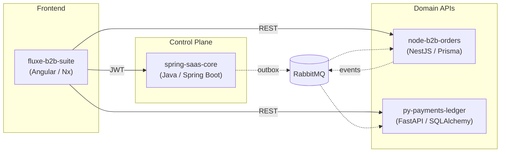

# Felipe Ricarte

Engenheiro de plataforma, construindo infraestrutura B2B SaaS na **Union Solutions**.

Foco em arquitetura multi-tenant, governança (ABAC), contratos entre serviços e observabilidade.

---

### Plataforma B2B — Visao Geral

---

### Stack

---

### Projetos

| Repo | O que faz | Stack |
|------|-----------|-------|
| [`spring-saas-core`](https://github.com/ricartefelipe/spring-saas-core) | Control plane multi-tenant: tenants, RBAC/ABAC, feature flags, auditoria, JWT, outbox | Java 21, Spring Boot, PostgreSQL, Redis, RabbitMQ |
| [`fluxe-b2b-suite`](https://github.com/ricartefelipe/fluxe-b2b-suite) | Suite frontend B2B: Shop, Ops Portal, Admin Console | Angular 21, Nx, TypeScript, pnpm |
| [`node-b2b-orders`](https://github.com/ricartefelipe/node-b2b-orders) | API de pedidos e inventario B2B com worker assincrono | NestJS, Prisma, PostgreSQL, Redis, RabbitMQ |
| [`py-payments-ledger`](https://github.com/ricartefelipe/py-payments-ledger) | Motor de pagamentos com ledger contabil double-entry | FastAPI, SQLAlchemy, Stripe, PostgreSQL, RabbitMQ |

---

### Stats

  
  

