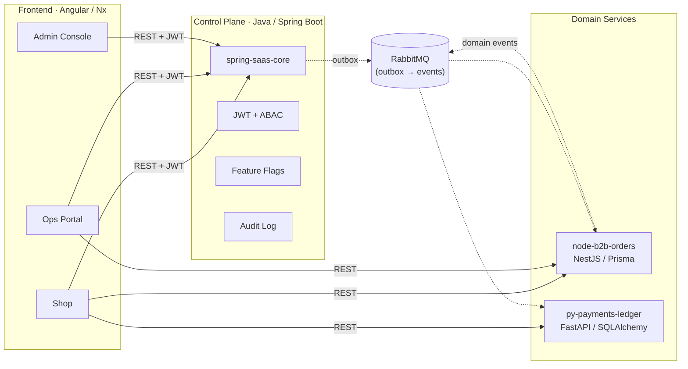

<h1 align="center">Felipe Ricarte Magalhães</h1>

  <strong>Arquiteto de backend na prática</strong> 
  Java, Spring Boot, Quarkus e Kotlin · APIs, nuvem, sistemas distribuídos, eventos e observabilidade

  &nbsp;
  &nbsp;
  &nbsp;
  

---

Sou arquiteto de software com **mais de 17 anos** de experiência construindo, evoluindo e mantendo sistemas corporativos e plataformas críticas em produção.

Atuo desde a definição da arquitetura até o código: decisões técnicas viram contratos de API, testes, pipelines, métricas e algo que a operação consegue sustentar. Meu eixo principal é o ecossistema **Java** (Spring Boot, Quarkus, Kotlin), com foco em sistemas distribuídos, arquitetura orientada a eventos, multi-tenant e observabilidade.

Não escolho tecnologia por modinha: o contexto (problema, time, operação e custo total) manda na decisão.

Hoje dedico esforço a uma **plataforma B2B de referência**, com control plane, serviços de domínio e frontend integrados, para exercitar multi-tenant, governança de acesso, mensageria e boas práticas de produção.

---

## Princípios na prática

| Princípio | O que significa |
|-----------|-----------------|
| **Isolamento por desenho** | Cada tenant opera com dados segregados via ABAC, sem vazamento entre contextos e sem atalhos frágeis. |
| **Contratos em primeiro lugar** | Integração por eventos tipados (outbox) e REST com esquemas versionados e previsíveis. |
| **Observabilidade desde o início** | Métricas, rastros e logs estruturados entram no desenho, não como complemento depois do go-live. |
| **Idempotência onde há efeito colateral** | Escritas em API e consumidores de fila tratam reprocessamento e duplicidade de forma explícita. |
| **Contexto acima do framework** | Spring Boot, Quarkus, serverless ou uma solução mais simples: depende do cenário, não da tendência. |
| **Produção como critério** | Se não dá para operar, rastrear e evoluir com segurança, a entrega ainda não está madura. |

---

## Arquitetura da plataforma B2B

Plataforma ponta a ponta com quatro repositórios independentes, integração assíncrona (outbox e eventos) e frontend unificado:

---

## Repositórios principais

<table>
  <tr>
    <td width="50%">
      <h3><a href="https://github.com/ricartefelipe/spring-saas-core">spring-saas-core</a></h3>
      
<strong>Control plane multi-tenant.</strong> Cadastro e ciclo de vida de tenants, papéis e políticas RBAC/ABAC, feature flags com auditoria, emissão e validação de JWT e padrão outbox para publicar eventos de forma consistente com o estado no banco. Centraliza o que é transversal às aplicações B2B sem acoplar regra de negócio de cada domínio.

      

        
        
        
        
      

    </td>
    <td width="50%">
      <h3><a href="https://github.com/ricartefelipe/fluxe-b2b-suite">fluxe-b2b-suite</a></h3>
      
<strong>Monorepo Nx com três apps Angular.</strong> <em>Shop</em> para catálogo, carrinho e jornada de compra; <em>Ops Portal</em> para operações do dia a dia; <em>Admin Console</em> para governança e configurações sensíveis. Compartilha bibliotecas de UI e clientes HTTP, alinhado ao control plane e às APIs de pedidos e pagamentos.

      

        
        
        
        
      

    </td>
  </tr>
  <tr>
    <td width="50%">
      <h3><a href="https://github.com/ricartefelipe/node-b2b-orders">node-b2b-orders</a></h3>
      
<strong>Serviço de pedidos e estoque B2B.</strong> API NestJS com Prisma sobre PostgreSQL, workers para processamento assíncrono, outbox para consistência com mensageria, limites de taxa e chaves de idempotência em operações críticas. Pensado para conviver com o control plane (identidade e autorização) e publicar eventos consumidos por outros serviços.

      

        
        
        
        
      

    </td>
    <td width="50%">
      <h3><a href="https://github.com/ricartefelipe/py-payments-ledger">py-payments-ledger</a></h3>
      
<strong>Pagamentos com razão contábil em partidas dobradas.</strong> FastAPI e SQLAlchemy modelam lançamentos, integração com Stripe para captura e webhooks, filas para efeitos colaterais e reconciliação. Objetivo: rastreabilidade financeira e consistência entre extrato externo e saldos internos.

      

        
        
        
        
      

    </td>
  </tr>
</table>

---

## Stack

<table>
  <tr>
    <td><strong>Linguagens</strong></td>
    <td>
      
      
      
      
    </td>
  </tr>
  <tr>
    <td><strong>Frameworks</strong></td>
    <td>
      
      
      
      
      
    </td>
  </tr>
  <tr>
    <td><strong>Dados e mensageria</strong></td>
    <td>
      
      
      
      
      
    </td>
  </tr>
  <tr>
    <td><strong>Nuvem</strong></td>
    <td>
      
      
      
      
      
    </td>
  </tr>
  <tr>
    <td><strong>Infra e CI/CD</strong></td>
    <td>
      
      
      
    </td>
  </tr>
  <tr>
    <td><strong>Segurança</strong></td>
    <td>
      
      
      
    </td>
  </tr>
  <tr>
    <td><strong>Observabilidade</strong></td>
    <td>
      
      
      
      
    </td>
  </tr>
</table>

---

## Outros projetos

| Repositório | Descrição |
|-------------|-----------|
| [`oficina-springboot-mvp`](https://github.com/ricartefelipe/oficina-springboot-mvp) | MVP em Spring Boot para gestão de oficinas mecânicas: cadastros, ordens de serviço e notificações. Inclui experimentos com feedback em tempo real (WebSocket ou canal parecido) para status de serviço. |
| [`oficina-auth-lambda`](https://github.com/ricartefelipe/oficina-auth-lambda) | Autenticação serverless: validação de CPF, emissão de JWT e integração com API Gateway. Stack com Python, AWS SAM e Terraform para empacotar e versionar a função e permissões. |
| [`oficina-infra-database`](https://github.com/ricartefelipe/oficina-infra-database) | Infraestrutura como código para banco na nuvem: rede (VPC, subnets), RDS, security groups e parâmetros alinhados ao ambiente do MVP da oficina. |
| [`oficina-infra-kubernetes-`](https://github.com/ricartefelipe/oficina-infra-kubernetes-) | Terraform e manifests para subir cluster Kubernetes: Kind em laboratório e desenho preparado para EKS em produção, com foco em rede e add-ons básicos. |
| [`assinaflow`](https://github.com/ricartefelipe/assinaflow) | Fluxo de assinaturas para um serviço de streaming: planos, ciclo de cobrança e regras de ativação/cancelamento, com persistência e APIs para o painel. |
| [`order-service`](https://github.com/ricartefelipe/order-service) | Microserviço de pedidos com cálculo de totais, descontos quando aplicável e persistência em PostgreSQL. Útil como laboratório de contratos REST e testes de integração. |

---

<strong>Estatísticas no GitHub</strong>

 

  
  

  

