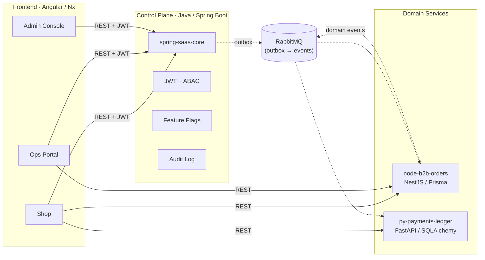

<h1 align="center">Felipe Ricarte Magalhães</h1>

  <strong>Backend Architect · Hands-on</strong> 
  Java, Spring Boot, Quarkus &amp; Kotlin &nbsp;|&nbsp; APIs, Cloud, Distributed Systems, Event-Driven &amp; Observability

  &nbsp;
  &nbsp;
  &nbsp;
  

---

Arquiteto de Software hands-on com **17+ anos** construindo, evoluindo e sustentando sistemas corporativos e plataformas críticas em produção.

Atuo da arquitetura à implementação — transformando decisões técnicas em código, contratos de API, testes, pipelines, métricas e soluções operáveis. Minha base é o ecossistema **Java** (Spring Boot, Quarkus, Kotlin), com forte atuação em sistemas distribuídos, event-driven architecture, multi-tenancy e observabilidade.

Mais do que defender um framework específico, minha atuação é orientada por **contexto**: escolho a solução conforme o problema, o time, a operação e o custo total.

Atualmente construindo uma **plataforma B2B completa** — do control plane ao frontend — como portfólio de engenharia de referência.

---

## Como Penso Engenharia

| Princípio | Na Pratica |
|-----------|-----------|
| **Isolamento por design** | Cada tenant opera com dados segregados via ABAC — sem vazamento, sem workaround |
| **Contratos primeiro** | Serviços se comunicam por eventos tipados (outbox) e REST com schemas versionados |
| **Observabilidade nativa** | Métricas, traces e logs estruturados desde o dia zero — não como afterthought |
| **Idempotência obrigatória** | Todo endpoint de escrita e todo consumer de fila são idempotentes por contrato |
| **Orientado por contexto** | Spring Boot, Quarkus, serverless ou solução mais simples — depende do problema, time e custo |
| **Produção como norte** | Código que não é operável, rastreável e sustentável não está pronto |

---

## Arquitetura da Plataforma B2B

Uma plataforma end-to-end com 4 repositórios independentes, comunicação assíncrona via outbox/event-driven, e frontend unificado:

---

## Repositórios Principais

<table>
  <tr>
    <td width="50%">
      <h3><a href="https://github.com/ricartefelipe/spring-saas-core">spring-saas-core</a></h3>
      
Control plane multi-tenant: gestão de tenants, RBAC/ABAC, feature flags, auditoria, emissão de JWT e outbox para eventos.

      

        
        
        
        
      

    </td>
    <td width="50%">
      <h3><a href="https://github.com/ricartefelipe/fluxe-b2b-suite">fluxe-b2b-suite</a></h3>
      
Suite frontend B2B com 3 aplicações: Shop (catálogo + carrinho), Ops Portal (gestão operacional) e Admin Console (governança).

      

        
        
        
        
      

    </td>
  </tr>
  <tr>
    <td width="50%">
      <h3><a href="https://github.com/ricartefelipe/node-b2b-orders">node-b2b-orders</a></h3>
      
API de pedidos e inventário B2B com worker assíncrono, outbox pattern, rate limiting e idempotência nativa.

      

        
        
        
        
      

    </td>
    <td width="50%">
      <h3><a href="https://github.com/ricartefelipe/py-payments-ledger">py-payments-ledger</a></h3>
      
Motor de pagamentos com ledger contábil double-entry, integração Stripe e reconciliação automática.

      

        
        
        
        
      

    </td>
  </tr>
</table>

---

## Stack Completa

<table>
  <tr>
    <td><strong>Linguagens</strong></td>
    <td>
      
      
      
      
    </td>
  </tr>
  <tr>
    <td><strong>Frameworks</strong></td>
    <td>
      
      
      
      
      
    </td>
  </tr>
  <tr>
    <td><strong>Dados & Messaging</strong></td>
    <td>
      
      
      
      
      
    </td>
  </tr>
  <tr>
    <td><strong>Cloud</strong></td>
    <td>
      
      
      
      
      
    </td>
  </tr>
  <tr>
    <td><strong>Infra & CI/CD</strong></td>
    <td>
      
      
      
    </td>
  </tr>
  <tr>
    <td><strong>Segurança</strong></td>
    <td>
      
      
      
    </td>
  </tr>
  <tr>
    <td><strong>Observabilidade</strong></td>
    <td>
      
      
      
      
    </td>
  </tr>
</table>

---

## Outros Projetos

| Repo | Descrição |
|------|-----------|
| [`oficina-springboot-mvp`](https://github.com/ricartefelipe/oficina-springboot-mvp) | Sistema de gerenciamento de oficinas mecânicas com feedback em tempo real |
| [`oficina-auth-lambda`](https://github.com/ricartefelipe/oficina-auth-lambda) | Função serverless de autenticação (CPF, JWT) — Python, SAM, Terraform |
| [`oficina-infra-database`](https://github.com/ricartefelipe/oficina-infra-database) | IaC para banco de dados na nuvem (VPC, subnets, RDS, Security Groups) |
| [`oficina-infra-kubernetes-`](https://github.com/ricartefelipe/oficina-infra-kubernetes-) | IaC para cluster Kubernetes (Kind para lab, EKS para produção) |
| [`assinaflow`](https://github.com/ricartefelipe/assinaflow) | Sistema de gestão de assinaturas para serviço de streaming |
| [`order-service`](https://github.com/ricartefelipe/order-service) | Microserviço de pedidos com cálculo de totais e persistência PostgreSQL |

---

<strong>GitHub Stats</strong>

 

  
  

  

